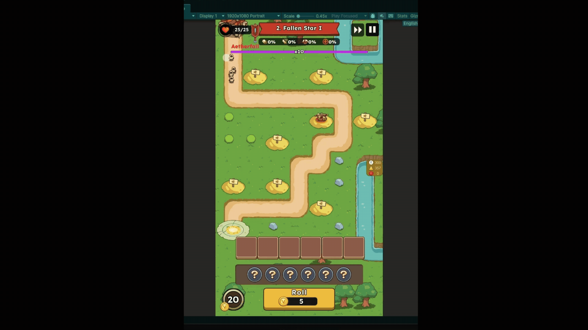
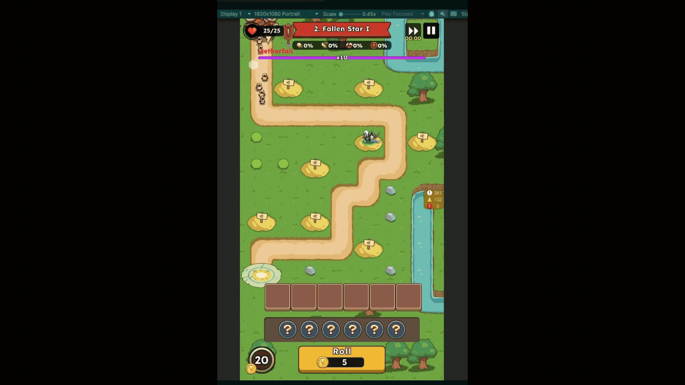
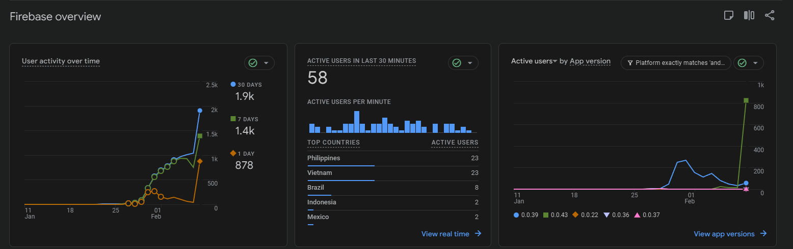

# Tower Master – Systems + Analytics Demo (Unity/C#)
Download Link - https://play.google.com/store/apps/details?id=com.thp022.empire.tower.defense.casual.td

**Highlights:** Weighted roulette economy (15 outcomes), event-driven UI/gameplay (Observer), pooling for 60 FPS mobile, Strategy-based skills.

## Demo
- Roulette → reward: (gif/video) 

- Merge/place-down UI: (gif/video) 
- Skills + status effects: (gif/video) 
()
()
()
()
()

- Stress wave performance (pooling): (gif/video) - need to be extracted

## What I built
- Weighted drop table roulette: outcomes, pack variants (3/4/5/6), mixed bundles
- Observer events: roll spend/result, merge/place-down
- Strategy + factories: skills/status effects
- Object pooling: enemies, projectiles, VFX (mobile 60 FPS target)

## Data / Analytics
- Drop-rate validation: Monte Carlo simulation vs expected probabilities - ([Verified 100k runs](Roulette_MonteCarlo_100000.csv))
- Notes on balancing: expected value, economy sinks/sources, tuning approach
- (Planned) A/B testing plan: metrics + guardrails

## UI
- Figma link + screen flow
- Implemented drag-and-drop placement + merge flow

## Disclaimer
This repo does not contain proprietary Zitga code/assets. Code is clean-room reimplementation for portfolio purposes.

## Demos (Gameplay Videos)
- **Feature Demo** — roulette outcomes, tower merge, UI flows, skills/status effects  
[(Game Demo)](https://youtu.be/5QYZQ8yh638)

